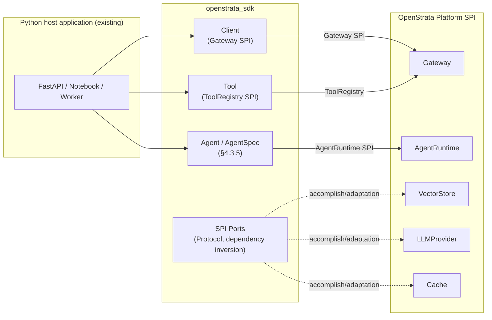
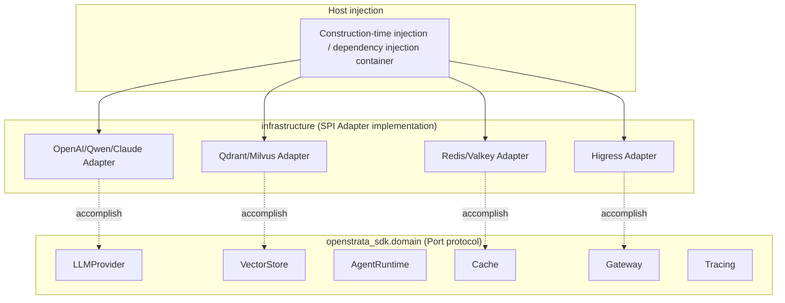
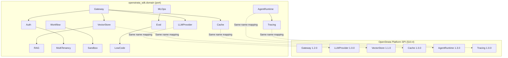
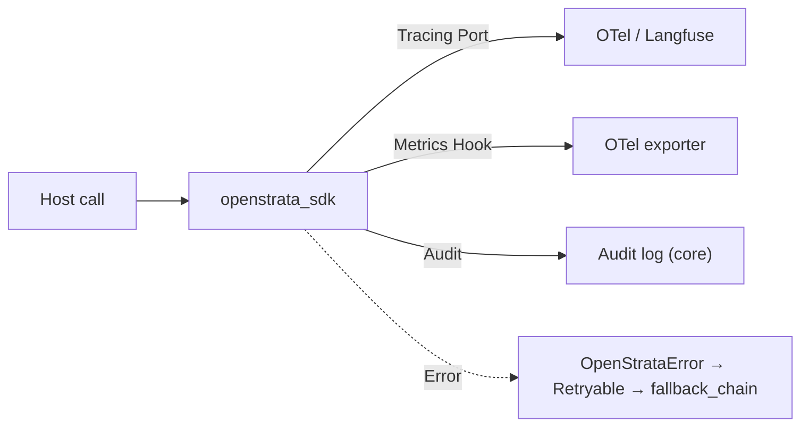

# ai-sdk-python · Detailed design (DESIGN)

> This file is the **detailed design document** of `ai-sdk-python`, covering and replacing the original placeholder skeleton of `design/DESIGN.md`.
> It co-evolves with the main repository `arch/` (architecture positioning), `skills/` (AI coding skills), `specs/` (contract), and major decisions are recorded as ADRs in `design/adr/`.
> `arch/` `skills/` `specs/` `README.md` is not within the scope of changes to this document.

| meta information | value |
| --- | --- |
| **repo** | ai-sdk-python |
| **Language·Framework** | Python / FastAPI + Pydantic v2 + Poetry (httpx client) |
| **domain** | sdk |
| **optional** | false (core, forced to be delivered with the platform) |
| **Platform version** | v1.4.0 (`strata v1.4.0`, released 2026-07-15) |
| **Document Status** | Draft |
| **Responsible Person** | OpenStrata Architecture Group |
| **Associated links** | [arch/ARCH.md](./../arch/ARCH.md) · [skills/SKILLS.md](./../skills/SKILLS.md) · [specs/SPECS.md](./../specs/SPECS.md) · Architecture documentation §4.3.5 / §4.4 / §10.4 / §10.6 / §12 / §15.5 / §16 |

---

## 1. Positioning and target users (application developers)

`ai-sdk-python` is a **developer library** published to **PyPI** (`pip install openstrata-sdk`, import name `openstrata_sdk`), and is not a deployable service.

- **What it solves**: Allow Python developers to build Agent/Client in a Pythonic way** (fluent builder, dataclass, async/await) in their existing Python applications (FastAPI service, Notebook, script, AI/ML pipeline), and access the runtime capabilities of the OpenStrata platform (gateway, Agent runtime, tool registration, memory, RAG, cache, observable).
- **SDK is not a gateway, not a runtime ontology**: SDK is "client + builder + extension port" - exposing objects such as `Client` / `Agent` / `Tool` to the outside world, and isolating anti-corrosion calls to platform SPI in the `infrastructure` layer. The host application only needs to import openstrata_sdk.
- **Target Users**:
1. **Python/AI Engineer**: Embed conversational Agent in existing FastAPI/scripts, encapsulate internal capabilities into platform tools (Tools), and connect business data to RAG.
2. **Platform secondary developer**: Implement a custom adapter based on the SPI port of the SDK (`LLMProvider` / `VectorStore` / `Cache` / `AgentRuntime` and other protocol classes) and inject it into the host application (dependency inversion, zero modification to the SDK core).
- **Relationship with §15.5**: The SDK only relies on **Python 3.11+ + pydantic v2 + httpx + a very small number of necessary dependencies** (such as `opentelemetry`), ensuring that it can be embedded in any Python host (§15.5.1 Framework convergence).



---

## 2. Core abstraction and API surface (Agent / Client / Tool / Session, etc.)

The domain layer of the SDK only defines **Port (Protocol/ABC)**, which exposes 5 first-class citizen objects + N SPI port protocols. See §15.5.2 / §15.5.3 for DDD four layers.

### 2.1 Package structure (Poetry)

```
ai-sdk-python/
├── app/                                   #Optional demo (non-publishing subject)
└── src/openstrata_sdk/
    ├── api/                               #① Access layer: Client, DTO (Pydantic v2)
    ├── application/                       #② Application layer: Agent orchestration use cases
    ├── domain/                            #③ Domain layer: AgentSpec/Tool/Session entity + Port(Protocol)
    ├── infrastructure/                    #④ Infrastructure layer: SPI Adapter (LLMProvider/VectorStore/Cache…)
    └── config.py                          #Configuration loading (infrastructure/config fragment rendering)
└── pyproject.toml                         #Poetry dependencies and packaging
```

### 2.2 Core Objects

| Abstract | Role | Corresponding platform SPI / Contract | Description |
| --- | --- | --- | --- |
| `Client` | Gateway client | **Gateway** SPI (§4.4.1, OpenAI-compatible) | Encapsulates chat/embed/stream/rerank; holds tenant Token |
| `Agent` / `AgentSpec` | AgentSpec builder | **AgentSpec** §4.3.5 / **AgentRuntime** SPI | Declarative binding `apiVersion/kind/metadata/model_binding/tool_bindings/memory_bindings/state_machine/guardrails` |
| `Tool` | Tool encapsulation | **ToolRegistry** (§4.3.2, MCP stdio/SSE/HTTP) | Declare JSON Schema, binding `tool_bindings`, can be local or registered to ToolRegistry |
| `Session` | Multi-round session/memory | **Cache** SPI (§4.3.4) + memory_bindings | Client handle for short/long term memory |
| `Retriever` | RAG retrieval | **VectorStore** SPI (§10.4) + **RAG** ​​SPI | Knowledge base retrieval, return hit fragments |

### 2.3 Domain layer Port protocol (dependency inversion, corresponding to §15.5.4)

The domain layer defines the following **SPI port protocol (typing.Protocol)** in `openstrata_sdk.domain`, and the name is strictly consistent with the §10.4 / §16 canonical port name**:

```python
from typing import Protocol, AsyncIterator, Optional
from openstrata_sdk.domain.models import (
    ChatRequest, ChatResponse, EmbedRequest, EmbedResponse,
    RerankRequest, RerankResponse, StreamChunk, Doc, Hit, AgentSpec, AgentHandle,
)

# LLMProvider —— Corresponding platform LLMProvider SPI（§4.4.4），interface_versions: 1.0.0
class LLMProvider(Protocol):
    def chat(self, req: ChatRequest) -> ChatResponse: ...
    def embed(self, req: EmbedRequest) -> EmbedResponse: ...
    def rerank(self, req: RerankRequest) -> RerankResponse: ...
    def stream(self, req: ChatRequest) -> AsyncIterator[StreamChunk]: ...

# VectorStore —— Corresponding platform VectorStore SPI（§10.4），interface_versions: 1.1.0
class VectorStore(Protocol):
    def upsert(self, collection: str, docs: list[Doc]) -> None: ...
    def search(self, collection: str, vec: list[float], top_k: int) -> list[Hit]: ...
    def delete(self, collection: str, ids: list[str]) -> None: ...

# AgentRuntime —— Corresponding platform AgentRuntime SPI（§10.6 / §4.3.5），interface_versions: 1.3.0
class AgentRuntime(Protocol):
    def load(self, spec: AgentSpec) -> AgentHandle: ...
    def run(self, handle: AgentHandle, input: dict) -> dict: ...

# Cache —— Corresponding platform Cache SPI（§4.3.4），interface_versions: 1.0.0
class Cache(Protocol):
    def get(self, key: str) -> Optional[bytes]: ...
    def set(self, key: str, val: bytes, ttl: float) -> None: ...

# Gateway —— Corresponding platform Gateway SPI（§4.4.1），interface_versions: 1.2.0
class Gateway(Protocol):
    def invoke(self, req: "GatewayRequest") -> "GatewayResponse": ...

# Tracing —— Corresponding platform Tracing SPI（§4.8），interface_versions: 1.0.0
class Tracing(Protocol):
    def start_span(self, name: str) -> "Span": ...
# remaining ports（Auth/RAG/LowCode/Workflow/Sandbox/CICD/MultiTenancy/MLOps/Eval）
# The protocol with the same name is exposed in domain Bag，See §6 mapping table，Guaranteed to be consistent with the platform。
```

> All port protocols **do not contain any specific framework/external component dependencies** and comply with the §15.5.2 domain layer prohibition.



---

## 3. Installation and initialization (Install & bootstrap)

### 3.1 Installation

```bash
# Python 3.11+，Poetry manage
poetry add openstrata-sdk==1.4.0
# or
pip install openstrata-sdk==1.4.0
```

`pyproject.toml` alignment: `openstrata-sdk = "1.4.0"`. The SDK only introduces necessary dependencies such as `pydantic>=2`, `httpx`, `opentelemetry-api`, etc., without retransmitting dependencies to avoid contaminating the host application (§15.5.1).

### 3.2 Initialization (bootstrap)

The SDK is assembled via `config.load()` from the `infrastructure/config/` fragment / environment variables / explicit `Client(...)` parameter. **Dependency Inversion + Construction Injection** is used by default; the host can also manually inject SPI implementation.

```python
from openstrata_sdk import Client
from openstrata_sdk.infrastructure import HigressGateway, QwenProvider, RedisCache

client = Client(
    gateway=HigressGateway.from_env(),
    llm_provider=QwenProvider.from_env(),   #Fill in DASHSCOPE_API_KEY and use it (§4.4.4 Third-party LLM)
    cache=RedisCache.from_env(),
)
```

```toml
# pyproject.toml [tool.openstrata]（infrastructure/config fragment，Must be rendered by meta repository，§15.6.3）
[tool.openstrata.gateway]
provider = "higress"
base_url = "${GATEWAY_BASE_URL}"
[tool.openstrata.model]
qwen = { type = "dashscope", default = true }   #Third-party LLM (§4.4.4)
openai = { type = "openai" }
claude = { type = "anthropic" }
[tool.openstrata.cache]
provider = "redis"                              #core;valkey is OSI replacement
[tool.openstrata.vector_store]
preference = "qdrant"                           #Default; milvus alternative (§10.4)
[tool.openstrata.observability]
otel_traces = true
audit_log = true                                #core baseline (§4.8)
```

> Phases 1 to 3 default to **third-party LLM API** (fill in the Key and use it, no GPU required, §4.4.2); `modelServing` (self-hosted vLLM/TGI) is only enabled in the full file, and the SDK switches seamlessly through the `LLMProvider` port (§4.4.4).

---

## 4. Key usage and code examples (Quickstart/Typical mode)

### 4.1 Quickstart: 30 minutes to run through the conversational Agent (corresponding to §11.2 Phase 1 MVP)

```python
from openstrata_sdk import Client
from openstrata_sdk.domain import AgentSpec, ModelBinding, ObjectSchema, Guardrails

client = Client.from_env()

# use AgentSpec The builder declares a convergence contract（§4.3.5）
spec = (
    AgentSpec.builder("customer-service-v2")
    .tenant("tenant-b")
    .model_binding(ModelBinding(preferred="cloud-qwen-max",
                                fallback_chain=["local-qwen2.5-72b", "cloud-gpt-4o"]))
    .input_schema(ObjectSchema("query", "string"))
    .output_schema(ObjectSchema("answer", "string"))
    .guardrails(Guardrails(basic=["injection_scan", "pii_scan", "rate_limit"]))
    .build()
)

# through AgentRuntime SPI Load and run（declarative、Runtime independent，§4.3.5）
handle = client.agent_runtime.load(spec)
out = client.agent_runtime.run(handle, {"query": "Where's my order?"})
print(out["answer"])
```

### 4.2 Typical mode A: Register a custom Tool (MCP/ToolRegistry, §4.3.2)

```python
from openstrata_sdk.domain import Tool

@Tool.register("order_lookup", input_schema=ObjectSchema("order_id", "string"))
def order_lookup(ctx, order_id: str) -> dict:
    return {"status": "shipped"}

# bind to spec.tool_bindings；or by Gateway SPI Register to the platform ToolRegistry
spec = spec.with_tool_bindings("order_lookup")
```

### 4.3 Typical mode B: RAG retrieval (VectorStore + RAG SPI, §10.4 / §4.5)

```python
# Search away VectorStore SPI；SDK Factory press tenant.vector_store_preference return Qdrant/Milvus Adapter（§10.4）
hits = client.vector_store.search("kb-tenant-b", query_vec, top_k=5)
# Hit fragment backfill gives LLMProvider of prompt（RAG Pipelines are composed by platforms，SDK Only the retrieval port is exposed）
```

### 4.4 Typical Mode C: Multiple rounds of Session/Memory (Cache SPI, §4.3.4)

```python
sess = client.session("user-123")
sess.set_working_memory_ttl(3600)               # working memory（§4.3.5 memory_bindings）
resp = client.chat(sess, "Remember my last name is Zhang")
```

---

## 5. SPI / extension point (how to access custom LLM / VectorStore / Tool)

The **extension point of the SDK is the platform SPI port** (the name is consistent with the §10.4 canonical port name). The host application only needs to implement the corresponding `domain` protocol class and pass it into the constructor to replace the default implementation - **zero changes to the SDK core** (dependency inversion + anti-corrosion layer ACL, §10.4 / §15.5.4).

### 5.1 Access custom LLMProvider (such as access to private inference)

```python
from openstrata_sdk.domain import LLMProvider, ChatRequest, ChatResponse

class MySelfHosted:
    def __init__(self, endpoint: str): self.endpoint = endpoint
    def chat(self, req: ChatRequest) -> ChatResponse:
        #Tune your own vLLM/TGI OpenAI-compatible endpoint
        ...
    def embed(self, req): ...
    def rerank(self, req): ...
    def stream(self, req): ...

# injection：replace default LLMProvider（full File self-hosting scenario，§4.4.2）
client = Client(llm_provider=MySelfHosted("http://vllm:8000"))
```

### 5.2 Access custom VectorStore / Cache

Implement `domain.VectorStore` / `domain.Cache` protocol classes, injected through `Client(vector_store=...)` / `Client(cache=...)` respectively. Multiple implementations coexisting (Qdrant/Milvus, Redis/Valkey) are routed by the SDK factory according to `tenant.vector_store_preference` (§10.4 Runtime routing).

### 5.3 Access custom AgentRuntime / Tracing

Implements `domain.AgentRuntime` / `domain.Tracing` protocol class, injected through `Client(agent_runtime=...)` / `Client(tracing=...)`. The SDK default implementation binds platform LangGraph (Python)/Spring AI (Java) instances, but the host can change the local map executor without changing the spec - because AgentSpec is declarative and has nothing to do with runtime (§4.3.5).

### 5.4 Complete list of SPI ports (strictly aligned with §10.4)

The SDK exposes all 15 types of port protocols: `Gateway`, `AgentRuntime`, `LLMProvider`, `VectorStore`, `Cache`, `Auth`, `Tracing`, `RAG`, `LowCode`, `Workflow`, `Sandbox`, `CICD`, `MultiTenancy`, `MLOps`, `Eval`. See §6 mapping table.

---

## 6. Mapping with platform SPI (→ §10.4)

The SPI extension point of the SDK is **strictly mapped** to the SPI port of the platform §10.4; port name = canonical name, `interface_versions` is taken from `bom.yaml` §16. The following table is the complete traceback of SDK Realm Port → Platform SPI.

| SDK domain port (domain) | Platform SPI port (§10.4 canonical) | interface_versions | SDK role | Default Adapter (bom.yaml) |
| --- | --- | --- | --- | --- |
| `Gateway` | **Gateway** | 1.2.0 | Production(invoke) | Higress(core) |
| `AgentRuntime` | **AgentRuntime** | 1.3.0 | Production (Load/Run) | LangGraph/Spring AI binding execution (core) |
| `LLMProvider` | **LLMProvider** | 1.0.0 | Production (chat/embed/rerank/stream) | Qwen-Cloud / OpenAI / Claude (core third party) |
| `VectorStore` | **VectorStore** | 1.1.0 | Production (upsert/search) | Qdrant (core)/Milvus (optional) |
| `Cache` | **Cache** | 1.0.0 | Production (semantic/accurate caching) | Redis (core)/Valkey (optional, OSI) |
| `Auth` | **Auth** | 1.0.0 | Consumption (tenant Token verification context) | Keycloak (core) |
| `Tracing` | **Tracing** | 1.0.0 | Production (span) | Langfuse (core) / OTel (core baseline) |
| `RAG` | **RAG** ​​| 1.0.0 | Consumption (retrieval backfill) | RAGFlow (core) |
| `LowCode` | **LowCode** | 1.0.0 | Consumption (canvas export AgentSpec) | Self-developed React Flow (core)/Dify (reference, non-OSI) |
| `Workflow` | **Workflow** | 1.0.0 | Consumption (long task orchestration) | Temporal (optional) |
| `Sandbox` | **Sandbox** | 1.0.0 | Consumption (code execution isolation) | Kata / E2B (optional) |
| `CICD` | **CICD** | 1.0.0 | Consumption (canary Release) | ArgoCD/Istio (optional) |
| `MultiTenancy` | **MultiTenancy** | 1.0.0 | Consumption (Tenant Isolation Context) | Capsule (optional) |
| `MLOps` | **MLOps** | 1.0.0 | Consume (fine-tuning/distillation) | MLflow (optional) |
| `Eval` | **Eval** | 1.0.0 | Consumption (evaluation reflow) | Promptfoo / DeepEval / Ragas (core/optional) |

> **Key constraints**:
> - The SDK port name is **word-for-word consistent** with the `bom.yaml` `spi` field (§16.2); new/replacement implementations never need to change the core (§10.6 Registry model).
> - Self-hosting and multiple third-party implementations coexist behind the same `LLMProvider` SPI, and cross-implementation failover is handled by the platform `ModelRouter` (§4.4.4 / §4.4.5).
> - When switching the VectorStore provider, the platform migrates Job double-write verification (§10.4), and the SDK obtains the corresponding Adapter through the SPI factory, **zero changes to the application code**.



---

## 7. Configuration and credentials (Config & credentials)

### 7.1 Configuration sources (configuration-driven progressive composition, §12)

The SDK configuration snippet is located in `infrastructure/config/` and must be in a format that can be rendered by Metacang (§15.6.3). Priority: `Construction parameters > Environment variables > pyproject.toml [tool.openstrata] > Platform Manifest delivery`.

```toml
# infrastructure/config/openstrata.toml（Main repository SPI adapter local fragment）
[openstrata.gateway]
provider = "higress"
base_url = "${GATEWAY_BASE_URL}"
[openstrata.model]
qwen = { type = "dashscope", default = true }     #Third-party LLM (§4.4.4)
openai = { type = "openai" }
claude = { type = "anthropic" }
[openstrata.cache]
provider = "redis"                                #core;valkey is OSI replacement
[openstrata.vector_store]
preference = "qdrant"                             #Default; milvus alternative (§10.4)
[openstrata.observability]
otel_traces = true
audit_log = true                                  #core baseline (§4.8)
```

### 7.2 Credential security (echoes §4.4.6)

- **Provider API Key is not exposed to tenants**: SDK only holds the **Tenant Token** issued by the platform, which is verified by the `Auth` port (Keycloak); the third-party Provider Key is stored in the platform Secret Vault, and the SDK is called indirectly through the Gateway and is never placed through the SDK.
- **Environment variable injection**: `DASHSCOPE_API_KEY` / `OPENAI_API_KEY` are only used in the "local self-hosting/direct connection debugging" scenario. Production must use the platform Gateway + tenant Token.
- **Data export control**: The SDK cooperates with the gateway to desensitize PII before third-party calls; the `no_egress` policy can be set to force only self-hosting (§4.4.6 / P6).

---

## 8. Version and compatibility strategy (SemVer, align platform interface_versions)

- **SDK Self Version**: Following SemVer, `openstrata-sdk==1.4.0` aligns with platform `strata v1.4.0` (§16.1). Breaking changes bump `MAJOR` with ADR (`design/adr/`).
- **SPI port version contract**: Each domain port is marked with the `interface_versions` (§16) to which it is aligned, evolving with the `bom.yaml` frozen snapshot. SDK 1.4.0 promises compatibility with:

| Port | Minimum compatible interface_version | Description |
  | --- | --- | --- |
| Gateway | 1.2.0 | OpenAI-compatible protocol unchanged |
| AgentRuntime | 1.3.0 | AgentSpec `apiVersion: openstrata.io/v1` Backwards Compatibility |
| LLMProvider | 1.0.0 | chat/embed/rerank/stream signature stable |
| VectorStore | 1.1.0 | upsert/search/delete stable |
| Cache | 1.0.0 | get/set stable |

- **Cross-language consistency**: `ai-sdk-go` / `ai-sdk-java` / `ai-sdk-python` The three-piece set has consistent semantics for method signatures on the same SPI port (AgentSpec convergence contract §4.3.5), ensuring that the same AgentSpec can be built by any language SDK and bound to any runtime instance for execution.
- **Minimum compatible interface version** is written into `specs/SPECS.md` compatibility commitment, and CI verifies the consistency of `bom.yaml` `interface_versions` when releasing (§16.4 / §15.6.4).

---

## 9. Error handling and observability (Tracing / metrics hooks)

### 9.1 Error model

- Unify `OpenStrataError`: `code` (platform error code, corresponding to Gateway response), `port` (error SPI port name), `retryable` (whether it can be retried for ModelRouter failover).
- Third-party LLM timeout/quota exceedance → `retryable=True` → SDK prompts the upper layer to go to `fallback_chain` (§4.4.5) and does not retry by itself to avoid an avalanche.
- Errors are logged in span status via the `Tracing` port and filed in `audit_log` (core baseline, §4.8).

### 9.2 Observability

- **Tracing**: Access OTel traces (core baseline) by default + optional Langfuse (§4.8 / §16). The host implements `domain.Tracing` to inject a custom backend.
- **Metrics hooks**: SDK exposes `Client(metrics_hook=callable)`, reports token usage, call delay, cache hit rate; metrics are exported through OTel exporter.
- **Audit**: Basic traces + auditing is enabled by default (AgentSpec `observability_hooks.trace/audit: enabled`, §4.3.5); `llm_eval` is optional.



---

## 10. Testing/Release Process

### 10.1 Test strategy (echoing arch/crosscutting convention)

- **Unit**: Domain layer pure logic (AgentSpec construction, Tool Schema verification) is separated from external components, fast and stable (pytest).
- **Integration**: pytest + container (testcontainers/docker) pulls up Qdrant (default)/Redis (default) and runs VectorStore/Cache Adapter.
- **SPI contract test**: Using the `domain` port protocol as the contract, assert that the default Adapter satisfies `interface_versions` (such as the structure returned by `VectorStore.search` is stable) - guaranteed to be consistent with §10.4 / §16.
- **Cross-language contract testing**: The three SDKs share an AgentSpec YAML fixture to verify parsing consistency (§4.3.5).

### 10.2 Release Process (PyPI)

1. Tag `v1.4.0` in the `ai-sdk-python` repository (aligned with `strata v1.4.0`, §16.1).
2. CI (`.github/`, each repository is independent): build → test → `ruff`/`mypy`/scan → `poetry publish` to PyPI (GPG signature optional).
3. Metacang `repos.yaml` / `bom.yaml` nail version (`tag: v1.4.0`, §15.6.4); Dependency Resolver is assembled accordingly.
4. The runtime can use the control plane `GET /v1/release/manifest` to audit whether the SDK version deviates from the certification list (§16.4).

---

## 11. Open questions

1. **AgentRuntime local execution**: Does the SDK provide a "pure Python local map executor" as a lightweight implementation of the `AgentRuntime` port (without relying on a LangGraph instance)? Or just do remote binding?
2. **Multi-tenant context propagation**: Does the `MultiTenancy` port on the SDK side only consume the tenant context issued by the platform, or does it allow the host to perform tenant isolation locally? Requires alignment with §4.8 audit boundaries.
3. **LowCode canvas export**: Is the `react-flow → AgentSpec` exporter of the `LowCode` port pushed down into the SDK, or is it only provided on the platform side? Affects cross-language consistency.
4. **Sandbox code execution**: When Tool executes code, does the SDK directly support the `Sandbox` port client, or is it routed uniformly through the Gateway? Involves network isolation policies (§4.3.3).
5. **Stream contract**: How to ensure semantic equivalence of the `LLMProvider.stream` return types of the three SDKs (Go channel / Java Flow / Python async iterator) requires the specs layer to supplement the cross-language streaming contract.
6. **LangGraph default binding**: The `AgentRuntime` port is bound to LangGraph by default (`langgraph-to-spec` adapter, §4.3.5). Is it necessary to also provide alternative Adapters such as CrewAI (§10.5 replace LangGraph → CrewAI new Adapter)?

---

### Tail

#### Open questions
See §11 (6 pending, converged with ADR).

#### Change Record

| Version | Date | Description |
| --- | --- | --- |
| v1.0.0-Draft | 2026-07-17 | First version of detailed design, covering placeholder skeleton; 11 sections + meta information + traceability matrix |

#### Traceability Matrix (Chapter of this document ↔ Architecture Design Document §)

| This document | Architecture design document § | Description |
| --- | --- | --- |
| §1 Positioning | §15.5.1 / §15.6.2 | SDK role, only relies on the standard library |
| §2 Core Abstraction | §4.3.5 / §15.5.2 / §15.5.4 | AgentSpec / DDD Layer 4 / Port=SPI |
| §3 Installation initialization | §15.5.1 / §12 | Framework convergence, configuration driver, Poetry |
| §4 Usage Examples | §4.3.5 / §4.4.1 / §4.4.4 / §10.4 | AgentSpec / Gateway / LLMProvider / VectorStore |
| §5 SPI extension point | §10.4 / §15.5.4 | Same name port, dependency inversion, ACL |
| §6 Platform SPI mapping | §10.4 / §10.6 / §16 | 15 port name + interface_versions |
| §7 Configuration and Credentials | §12 / §4.4.6 | Manifest / Key Vault / Exit Control |
| §8 version compatible | §16.1 / §16.2 | SemVer / interface_versions |
| §9 Observability | §4.8 / §16 | OTel / Langfuse / Audit Baseline |
| §10 Test Release | §15.6.4 / §16.4 | CI / BOM Pin Version per Repository |
| §11 Open Issues | §4.3.3 / §4.3.5 / §4.8 / §10.5 | Pending Items |
