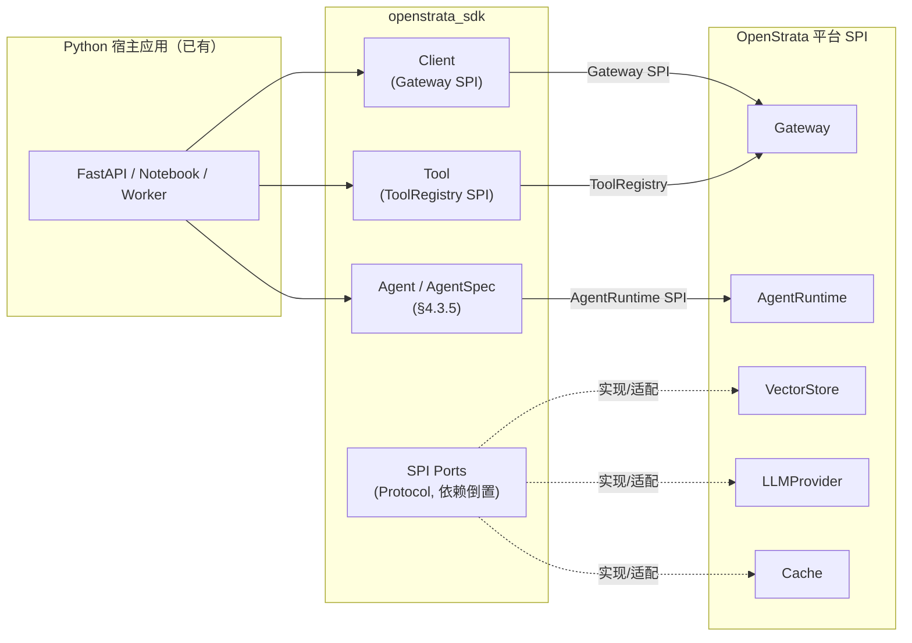
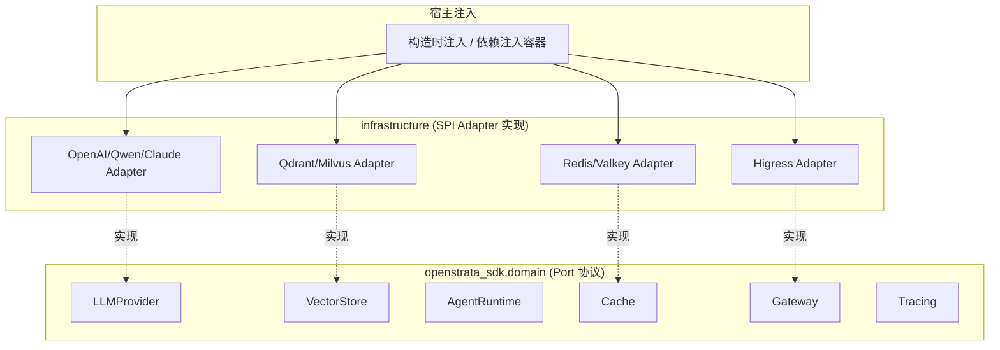
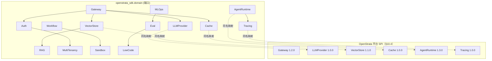
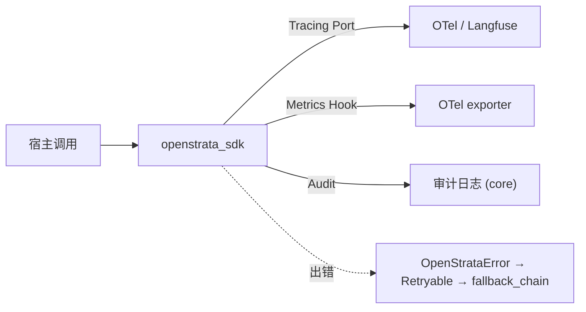

# ai-sdk-python · 详细设计（DESIGN）

> 本文件是 `ai-sdk-python` 的**详细设计文档**，覆盖并取代 `design/DESIGN.md` 原占位骨架。
> 它与本仓 `arch/`（架构定位）、`skills/`（AI 编码技能）、`specs/`（契约）协同演化，重大决策以 ADR 沉淀于 `design/adr/`。
> `arch/` `skills/` `specs/` `README.md` 不在本文档改动范围内。

| 元信息 | 值 |
| --- | --- |
| **repo** | ai-sdk-python |
| **语言·框架** | Python / FastAPI + Pydantic v2 + Poetry（httpx 客户端） |
| **领域（domain）** | sdk |
| **optional** | false（core，强制随平台交付） |
| **平台版本** | v1.4.0（`strata v1.4.0`，released 2026-07-15） |
| **文档状态** | 草稿 |
| **负责人** | OpenStrata 架构组 |
| **关联链接** | [arch/ARCH.md](./../arch/ARCH.md) · [skills/SKILLS.md](./../skills/SKILLS.md) · [specs/SPECS.md](./../specs/SPECS.md) · 架构文档 §4.3.5 / §4.4 / §10.4 / §10.6 / §12 / §15.6 / §16 |

---

## 1. 定位与目标用户（应用开发者）

`ai-sdk-python` 是发布到 **PyPI**（`pip install openstrata-sdk`，import 名 `openstrata_sdk`）的**开发者库**，不是可部署服务。

- **它解决什么**：让 Python 开发者在自己已有的 Python 应用（FastAPI 服务、Notebook、脚本、AI/ML 管线）中，**以 Pythonic 方式**（fluent builder、dataclass、async/await）构建 Agent / Client，并接入 OpenStrata 平台的运行时能力（网关、Agent 运行时、工具注册、记忆、RAG、缓存、可观测）。
- **SDK 不是网关、不是运行时本体**：SDK 是"客户端 + 构建器 + 扩展端口"——对外暴露 `Client` / `Agent` / `Tool` 等对象，并把对平台 SPI 的防腐调用隔离在 `infrastructure` 层。宿主应用只需 `import openstrata_sdk`。
- **目标用户**：
  1. **Python/AI 工程师**：在现有 FastAPI/脚本中嵌入对话式 Agent、把内部能力封装成平台工具（Tool）、把业务数据接入 RAG。
  2. **平台二次开发者**：基于 SDK 的 SPI 端口（`LLMProvider` / `VectorStore` / `Cache` / `AgentRuntime` 等协议类）实现自定义适配器，注入到宿主应用（依赖倒置，零改 SDK 核心）。
- **与 §15.6 的关系**：SDK 仅依赖 **Python 3.11+ + pydantic v2 + httpx + 极少量必要依赖**（如 `opentelemetry`），保证可嵌入任意 Python 宿主（§15.6.1 框架收敛）。



---

## 2. 核心抽象与 API 表面（Agent / Client / Tool / Session 等）

SDK 的领域层只定义 **Port（Protocol/ABC）**，对外暴露 5 个一等公民对象 + N 个 SPI 端口协议。DDD 四层见 §15.6.2 / §15.6.3。

### 2.1 包结构（Poetry）

```
ai-sdk-python/
├── app/                                   # 可选 demo（非发布主体）
└── src/openstrata_sdk/
    ├── api/                               # ① 接入层：Client、DTO（Pydantic v2）
    ├── application/                       # ② 应用层：Agent 编排用例
    ├── domain/                            # ③ 领域层：AgentSpec/Tool/Session 实体 + Port(Protocol)
    ├── infrastructure/                    # ④ 基础设施层：SPI Adapter（LLMProvider/VectorStore/Cache…）
    └── config.py                          # 配置加载（infrastructure/config 片段渲染）
└── pyproject.toml                         # Poetry 依赖与打包
```

### 2.2 核心对象

| 抽象 | 角色 | 对应平台 SPI / 契约 | 说明 |
| --- | --- | --- | --- |
| `Client` | Gateway 客户端 | **Gateway** SPI（§4.4.1，OpenAI-compatible） | 封装 chat/embed/stream/rerank；持有租户 Token |
| `Agent` / `AgentSpec` | AgentSpec 构建器 | **AgentSpec** §4.3.5 / **AgentRuntime** SPI | 声明式拼装 `apiVersion/kind/metadata/model_binding/tool_bindings/memory_bindings/state_machine/guardrails` |
| `Tool` | 工具封装 | **ToolRegistry**（§4.3.2，MCP stdio/SSE/HTTP） | 声明 JSON Schema、绑定 `tool_bindings`，可本地或注册到 ToolRegistry |
| `Session` | 多轮会话 / 记忆 | **Cache** SPI（§4.3.4）+ memory_bindings | 短期/长期记忆的客户端句柄 |
| `Retriever` | RAG 检索 | **VectorStore** SPI（§10.4）+ **RAG** SPI | 知识库检索，返回命中片段 |

### 2.3 领域层 Port 协议（依赖倒置，对应 §15.6.4）

领域层在 `openstrata_sdk.domain` 中定义以下 **SPI 端口协议（typing.Protocol）**，名称与 §10.4 / §16 canonical 端口名**严格一致**：

```python
from typing import Protocol, AsyncIterator, Optional
from openstrata_sdk.domain.models import (
    ChatRequest, ChatResponse, EmbedRequest, EmbedResponse,
    RerankRequest, RerankResponse, StreamChunk, Doc, Hit, AgentSpec, AgentHandle,
)

# LLMProvider —— 对应平台 LLMProvider SPI（§4.4.4），interface_versions: 1.0.0
class LLMProvider(Protocol):
    def chat(self, req: ChatRequest) -> ChatResponse: ...
    def embed(self, req: EmbedRequest) -> EmbedResponse: ...
    def rerank(self, req: RerankRequest) -> RerankResponse: ...
    def stream(self, req: ChatRequest) -> AsyncIterator[StreamChunk]: ...

# VectorStore —— 对应平台 VectorStore SPI（§10.4），interface_versions: 1.1.0
class VectorStore(Protocol):
    def upsert(self, collection: str, docs: list[Doc]) -> None: ...
    def search(self, collection: str, vec: list[float], top_k: int) -> list[Hit]: ...
    def delete(self, collection: str, ids: list[str]) -> None: ...

# AgentRuntime —— 对应平台 AgentRuntime SPI（§10.6 / §4.3.5），interface_versions: 1.3.0
class AgentRuntime(Protocol):
    def load(self, spec: AgentSpec) -> AgentHandle: ...
    def run(self, handle: AgentHandle, input: dict) -> dict: ...

# Cache —— 对应平台 Cache SPI（§4.3.4），interface_versions: 1.0.0
class Cache(Protocol):
    def get(self, key: str) -> Optional[bytes]: ...
    def set(self, key: str, val: bytes, ttl: float) -> None: ...

# Gateway —— 对应平台 Gateway SPI（§4.4.1），interface_versions: 1.2.0
class Gateway(Protocol):
    def invoke(self, req: "GatewayRequest") -> "GatewayResponse": ...

# Tracing —— 对应平台 Tracing SPI（§4.8），interface_versions: 1.0.0
class Tracing(Protocol):
    def start_span(self, name: str) -> "Span": ...
# 其余端口（Auth/RAG/LowCode/Workflow/Sandbox/CICD/MultiTenancy/MLOps/Eval）
# 同以同名协议暴露在 domain 包，见 §6 映射表，保证与平台一致。
```

> 所有端口协议**不含任何具体框架/外部组件依赖**，符合 §15.6.2 领域层禁令。



---

## 3. 安装与初始化（Install & bootstrap）

### 3.1 安装

```bash
# Python 3.11+，Poetry 管理
poetry add openstrata-sdk==1.4.0
# 或
pip install openstrata-sdk==1.4.0
```

`pyproject.toml` 对齐：`openstrata-sdk = "1.4.0"`。SDK 仅引入 `pydantic>=2`、`httpx`、`opentelemetry-api` 等必要依赖，无重传递依赖，避免污染宿主应用（§15.6.1）。

### 3.2 初始化（bootstrap）

SDK 通过 `config.load()` 从 `infrastructure/config/` 片段 / 环境变量 / 显式 `Client(...)` 参数装配。默认采用**依赖倒置 + 构造注入**；宿主也可手动注入 SPI 实现。

```python
from openstrata_sdk import Client
from openstrata_sdk.infrastructure import HigressGateway, QwenProvider, RedisCache

client = Client(
    gateway=HigressGateway.from_env(),
    llm_provider=QwenProvider.from_env(),   # 填 DASHSCOPE_API_KEY 即用（§4.4.4 第三方 LLM）
    cache=RedisCache.from_env(),
)
```

```toml
# pyproject.toml [tool.openstrata]（基础设施/config 片段，须可被元仓渲染，§15.7.3）
[tool.openstrata.gateway]
provider = "higress"
base_url = "${GATEWAY_BASE_URL}"
[tool.openstrata.model]
qwen = { type = "dashscope", default = true }   # 第三方 LLM（§4.4.4）
openai = { type = "openai" }
claude = { type = "anthropic" }
[tool.openstrata.cache]
provider = "redis"                              # core；valkey 为 OSI 替代
[tool.openstrata.vector_store]
preference = "qdrant"                           # 默认；milvus 备选（§10.4）
[tool.openstrata.observability]
otel_traces = true
audit_log = true                                # core 基线（§4.8）
```

> 阶段一~三默认走**第三方 LLM API**（填 Key 即用、无需 GPU，§4.4.2）；`modelServing`（自托管 vLLM/TGI）仅在 full 档启用，SDK 通过 `LLMProvider` 端口无感切换（§4.4.4）。

---

## 4. 关键用法与代码示例（Quickstart / 典型模式）

### 4.1 Quickstart：30 分钟跑通对话式 Agent（对应 §11.2 阶段一 MVP）

```python
from openstrata_sdk import Client
from openstrata_sdk.domain import AgentSpec, ModelBinding, ObjectSchema, Guardrails

client = Client.from_env()

# 用 AgentSpec 构建器声明一份收敛契约（§4.3.5）
spec = (
    AgentSpec.builder("customer-service-v2")
    .tenant("tenant-b")
    .model_binding(ModelBinding(preferred="cloud-qwen-max",
                                fallback_chain=["local-qwen2.5-72b", "cloud-gpt-4o"]))
    .input_schema(ObjectSchema("query", "string"))
    .output_schema(ObjectSchema("answer", "string"))
    .guardrails(Guardrails(basic=["injection_scan", "pii_scan", "rate_limit"]))
    .build()
)

# 经 AgentRuntime SPI 加载并运行（声明式、与运行时无关，§4.3.5）
handle = client.agent_runtime.load(spec)
out = client.agent_runtime.run(handle, {"query": "我的订单到哪了？"})
print(out["answer"])
```

### 4.2 典型模式 A：注册自定义 Tool（MCP / ToolRegistry，§4.3.2）

```python
from openstrata_sdk.domain import Tool

@Tool.register("order_lookup", input_schema=ObjectSchema("order_id", "string"))
def order_lookup(ctx, order_id: str) -> dict:
    return {"status": "shipped"}

# 绑定到 spec.tool_bindings；或经 Gateway SPI 注册到平台 ToolRegistry
spec = spec.with_tool_bindings("order_lookup")
```

### 4.3 典型模式 B：RAG 检索（VectorStore + RAG SPI，§10.4 / §4.5）

```python
# 检索走 VectorStore SPI；SDK 工厂按 tenant.vector_store_preference 返回 Qdrant/Milvus Adapter（§10.4）
hits = client.vector_store.search("kb-tenant-b", query_vec, top_k=5)
# 命中片段回填给 LLMProvider 的 prompt（RAG 管线由平台组合，SDK 仅暴露检索端口）
```

### 4.4 典型模式 C：多轮 Session / 记忆（Cache SPI，§4.3.4）

```python
sess = client.session("user-123")
sess.set_working_memory_ttl(3600)               # working memory（§4.3.5 memory_bindings）
resp = client.chat(sess, "记住我姓张")
```

---

## 5. SPI / 扩展点（如何接入自定义 LLM / VectorStore / Tool）

SDK 的**扩展点即平台 SPI 端口**（名称与 §10.4 canonical 端口名一致）。宿主应用只需实现对应 `domain` 协议类并传入构造器，即可替换默认实现——**零改动 SDK 核心**（依赖倒置 + 防腐层 ACL，§10.4 / §15.6.4）。

### 5.1 接入自定义 LLMProvider（如接入私有推理）

```python
from openstrata_sdk.domain import LLMProvider, ChatRequest, ChatResponse

class MySelfHosted:
    def __init__(self, endpoint: str): self.endpoint = endpoint
    def chat(self, req: ChatRequest) -> ChatResponse:
        # 调自有 vLLM/TGI OpenAI-compatible 端点
        ...
    def embed(self, req): ...
    def rerank(self, req): ...
    def stream(self, req): ...

# 注入：替换默认 LLMProvider（full 档自托管场景，§4.4.2）
client = Client(llm_provider=MySelfHosted("http://vllm:8000"))
```

### 5.2 接入自定义 VectorStore / Cache

实现 `domain.VectorStore` / `domain.Cache` 协议类，分别通过 `Client(vector_store=...)` / `Client(cache=...)` 注入。多实现并存（Qdrant/Milvus、Redis/Valkey）由 SDK 工厂按 `tenant.vector_store_preference` 路由（§10.4 运行时路由）。

### 5.3 接入自定义 AgentRuntime / Tracing

实现 `domain.AgentRuntime` / `domain.Tracing` 协议类，经 `Client(agent_runtime=...)` / `Client(tracing=...)` 注入。SDK 默认实现绑定平台 LangGraph（Python）/Spring AI（Java）实例，但**宿主可换本地图执行器**而不改 spec——因为 AgentSpec 声明式、与运行时无关（§4.3.5）。

### 5.4 SPI 端口完整清单（与 §10.4 严格对齐）

SDK 暴露全部 15 类端口协议：`Gateway`、`AgentRuntime`、`LLMProvider`、`VectorStore`、`Cache`、`Auth`、`Tracing`、`RAG`、`LowCode`、`Workflow`、`Sandbox`、`CICD`、`MultiTenancy`、`MLOps`、`Eval`。见 §6 映射表。

---

## 6. 与平台 SPI 的映射（→ §10.4）

SDK 的 SPI 扩展点**严格映射**到平台 §10.4 的 SPI 端口；端口名 = canonical 名，`interface_versions` 取自 `bom.yaml` §16。下表是 SDK 领域端口 → 平台 SPI 的完整追溯。

| SDK 领域端口（domain） | 平台 SPI 端口（§10.4 canonical） | interface_versions | SDK 角色 | 默认 Adapter（bom.yaml） |
| --- | --- | --- | --- | --- |
| `Gateway` | **Gateway** | 1.2.0 | 生产（invoke） | Higress（core） |
| `AgentRuntime` | **AgentRuntime** | 1.3.0 | 生产（Load/Run） | LangGraph/Spring AI 绑定执行（core） |
| `LLMProvider` | **LLMProvider** | 1.0.0 | 生产（chat/embed/rerank/stream） | Qwen-Cloud / OpenAI / Claude（core 第三方） |
| `VectorStore` | **VectorStore** | 1.1.0 | 生产（upsert/search） | Qdrant（core）/ Milvus（optional） |
| `Cache` | **Cache** | 1.0.0 | 生产（语义/精确缓存） | Redis（core）/ Valkey（optional, OSI） |
| `Auth` | **Auth** | 1.0.0 | 消费（租户 Token 校验上下文） | Keycloak（core） |
| `Tracing` | **Tracing** | 1.0.0 | 生产（span） | Langfuse（core）/ OTel（core 基线） |
| `RAG` | **RAG** | 1.0.0 | 消费（检索回填） | RAGFlow（core） |
| `LowCode` | **LowCode** | 1.0.0 | 消费（画布导出 AgentSpec） | 自研 React Flow（core）/ Dify（reference, 非 OSI） |
| `Workflow` | **Workflow** | 1.0.0 | 消费（长任务编排） | Temporal（optional） |
| `Sandbox` | **Sandbox** | 1.0.0 | 消费（代码执行隔离） | Kata / E2B（optional） |
| `CICD` | **CICD** | 1.0.0 | 消费（灰度发布） | ArgoCD / Istio（optional） |
| `MultiTenancy` | **MultiTenancy** | 1.0.0 | 消费（租户隔离上下文） | Capsule（optional） |
| `MLOps` | **MLOps** | 1.0.0 | 消费（微调/蒸馏） | MLflow（optional） |
| `Eval` | **Eval** | 1.0.0 | 消费（评测回流） | Promptfoo / DeepEval / Ragas（core/optional） |

> **关键约束**：
> - SDK 端口名与 `bom.yaml` `spi` 字段**逐字一致**（§16.2）；新增/替换实现永不需改核心（§10.6 Registry 模型）。
> - 同一 `LLMProvider` SPI 背后并存自托管与多个第三方实现，跨实现故障转移由平台 `ModelRouter` 负责（§4.4.4 / §4.4.5）。
> - 切换 VectorStore 提供方时由平台迁移 Job 双写校验（§10.4），SDK 经 SPI 工厂拿对应 Adapter，**业务代码零改动**。



---

## 7. 配置与凭证（Config & credentials）

### 7.1 配置来源（配置驱动渐进式组合，§12）

SDK 配置片段位于 `infrastructure/config/`，格式须可被元仓渲染（§15.7.3）。优先级：`构造参数 > 环境变量 > pyproject.toml [tool.openstrata] > 平台 Manifest 下发`。

```toml
# infrastructure/config/openstrata.toml（本仓 SPI 适配器局部片段）
[openstrata.gateway]
provider = "higress"
base_url = "${GATEWAY_BASE_URL}"
[openstrata.model]
qwen = { type = "dashscope", default = true }     # 第三方 LLM（§4.4.4）
openai = { type = "openai" }
claude = { type = "anthropic" }
[openstrata.cache]
provider = "redis"                                # core；valkey 为 OSI 替代
[openstrata.vector_store]
preference = "qdrant"                             # 默认；milvus 备选（§10.4）
[openstrata.observability]
otel_traces = true
audit_log = true                                  # core 基线（§4.8）
```

### 7.2 凭证安全（呼应 §4.4.6）

- **Provider API Key 不向租户暴露**：SDK 只持有平台签发的**租户 Token**，由 `Auth` 端口（Keycloak）校验；第三方 Provider Key 存于平台 Secret Vault，SDK 经 Gateway 间接调用，永不经 SDK 落盘。
- **环境变量注入**：`DASHSCOPE_API_KEY` / `OPENAI_API_KEY` 仅用于"本地自托管/直连调试"场景，生产必须走平台 Gateway + 租户 Token。
- **数据出境管控**：第三方调用前 SDK 配合网关做 PII 脱敏；可设 `no_egress` 策略强制仅走自托管（§4.4.6 / P6）。

---

## 8. 版本与兼容策略（SemVer，对齐 platform interface_versions）

- **SDK 自身版本**：遵循 SemVer，`openstrata-sdk==1.4.0` 对齐平台 `strata v1.4.0`（§16.1）。破坏性变更 bump `MAJOR` 并附 ADR（`design/adr/`）。
- **SPI 端口版本契约**：每个领域端口标注其所对齐的 `interface_versions`（§16），随 `bom.yaml` 冻结快照演进。SDK 1.4.0 承诺兼容：

  | 端口 | 最低兼容 interface_version | 说明 |
  | --- | --- | --- |
  | Gateway | 1.2.0 | OpenAI-compatible 协议不变 |
  | AgentRuntime | 1.3.0 | AgentSpec `apiVersion: openstrata.io/v1` 向后兼容 |
  | LLMProvider | 1.0.0 | chat/embed/rerank/stream 签名稳定 |
  | VectorStore | 1.1.0 | upsert/search/delete 稳定 |
  | Cache | 1.0.0 | get/set 稳定 |

- **跨语言一致性**：`ai-sdk-go` / `ai-sdk-java` / `ai-sdk-python` 三件套对同一 SPI 端口的方法签名语义一致（AgentSpec 收敛契约 §4.3.5），保证同一份 AgentSpec 可被任一语言 SDK 构建、任一运行时实例绑定执行。
- **最低兼容接口版本**写入 `specs/SPECS.md` 兼容性承诺，CI 在发版时校验 `bom.yaml` `interface_versions` 一致性（§16.4 / §15.7.4）。

---

## 9. 错误处理与可观测性（Tracing / metrics hooks）

### 9.1 错误模型

- 统一 `OpenStrataError`：`code`（平台错误码，对应 Gateway 响应）、`port`（出错 SPI 端口名）、`retryable`（是否可重试，供 ModelRouter 故障转移）。
- 第三方 LLM 超时/配额超限 → `retryable=True` → SDK 提示上层走 `fallback_chain`（§4.4.5），不自行重试以免雪崩。
- 错误经 `Tracing` 端口记录 span 状态，并归入 `audit_log`（core 基线，§4.8）。

### 9.2 可观测性

- **Tracing**：默认接入 OTel traces（core 基线）+ 可选 Langfuse（§4.8 / §16）。宿主实现 `domain.Tracing` 注入自定义后端。
- **Metrics hooks**：SDK 暴露 `Client(metrics_hook=callable)`，上报 token 用量、调用延迟、缓存命中率；指标经 OTel exporter 导出。
- **审计**：基础 traces + 审计默认开（AgentSpec `observability_hooks.trace/audit: enabled`，§4.3.5）；`llm_eval` 可选。



---

## 10. 测试 / 发布流程

### 10.1 测试策略（呼应 arch/ 横切约定）

- **单元**：领域层纯逻辑（AgentSpec 构建、Tool Schema 校验）脱离外部组件，快速稳定（pytest）。
- **集成**：pytest + 容器（testcontainers / docker）拉起 Qdrant（默认）/Redis（默认），跑 VectorStore/Cache Adapter。
- **SPI 契约测试**：以 `domain` 端口协议为契约，断言默认 Adapter 满足 `interface_versions`（如 `VectorStore.search` 返回结构稳定）——保证与 §10.4 / §16 一致。
- **跨语言契约测试**：三 SDK 共用一份 AgentSpec YAML fixture，验证解析一致性（§4.3.5）。

### 10.2 发布流程（PyPI）

1. 在 `ai-sdk-python` 仓打 tag `v1.4.0`（与 `strata v1.4.0` 对齐，§16.1）。
2. CI（`.github/`，每仓独立）：build → test → `ruff`/`mypy`/scan → `poetry publish` 到 PyPI（GPG 签名可选）。
3. 元仓 `repos.yaml` / `bom.yaml` 钉版本（`tag: v1.4.0`，§15.7.4）；Dependency Resolver 据此装配。
4. 运行时可通过控制面 `GET /v1/release/manifest` 审计 SDK 版本是否偏离认证清单（§16.4）。

---

## 11. 开放问题

1. **AgentRuntime 本地执行**：SDK 是否提供"纯 Python 本地图执行器"作为 `AgentRuntime` 端口的轻量实现（不依赖 LangGraph 实例）？还是仅做远程绑定？
2. **多租户上下文传播**：`MultiTenancy` 端口在 SDK 侧是仅消费平台下发的租户上下文，还是允许宿主本地做租户隔离？需与 §4.8 审计边界对齐。
3. **LowCode 画布导出**：`LowCode` 端口的 `react-flow → AgentSpec` 导出器是否下沉到 SDK，还是仅平台侧提供？影响跨语言一致性。
4. **Sandbox 代码执行**：Tool 执行代码时 SDK 是否直接持 `Sandbox` 端口客户端，还是统一经 Gateway 路由？涉及网络隔离策略（§4.3.3）。
5. **流式（stream）契约**：三 SDK 的 `LLMProvider.stream` 返回类型（Go channel / Java Flow / Python async iterator）如何保证语义等价，需 specs 层补充跨语言流式契约。
6. **LangGraph 默认绑定**：`AgentRuntime` 端口默认绑定 LangGraph（`langgraph-to-spec` 适配器，§4.3.5），是否需要同时提供 CrewAI 等备选 Adapter（§10.5 替换 LangGraph → CrewAI 新增 Adapter）？

---

### 尾部

#### 开放问题
见 §11（6 项待决，随 ADR 收敛）。

#### 变更记录

| 版本 | 日期 | 说明 |
| --- | --- | --- |
| v1.0.0-草稿 | 2026-07-17 | 初版详细设计，覆盖占位骨架；11 节 + 元信息 + 追溯矩阵 |

#### 追溯矩阵（本文档章节 ↔ 架构设计文档 §）

| 本文档 | 架构设计文档 § | 说明 |
| --- | --- | --- |
| §1 定位 | §15.6.1 / §15.7.2 | SDK 角色、仅依赖标准库 |
| §2 核心抽象 | §4.3.5 / §15.6.2 / §15.6.4 | AgentSpec / DDD 四层 / Port=SPI |
| §3 安装初始化 | §15.6.1 / §12 | 框架收敛、配置驱动、Poetry |
| §4 用法示例 | §4.3.5 / §4.4.1 / §4.4.4 / §10.4 | AgentSpec / Gateway / LLMProvider / VectorStore |
| §5 SPI 扩展点 | §10.4 / §15.6.4 | 同名端口、依赖倒置、ACL |
| §6 平台 SPI 映射 | §10.4 / §10.6 / §16 | 15 端口名 + interface_versions |
| §7 配置与凭证 | §12 / §4.4.6 | Manifest / 密钥 Vault / 出境管控 |
| §8 版本兼容 | §16.1 / §16.2 | SemVer / interface_versions |
| §9 可观测性 | §4.8 / §16 | OTel / Langfuse / 审计基线 |
| §10 测试发布 | §15.7.4 / §16.4 | 每仓 CI / BOM 钉版本 |
| §11 开放问题 | §4.3.3 / §4.3.5 / §4.8 / §10.5 | 待决项 |
